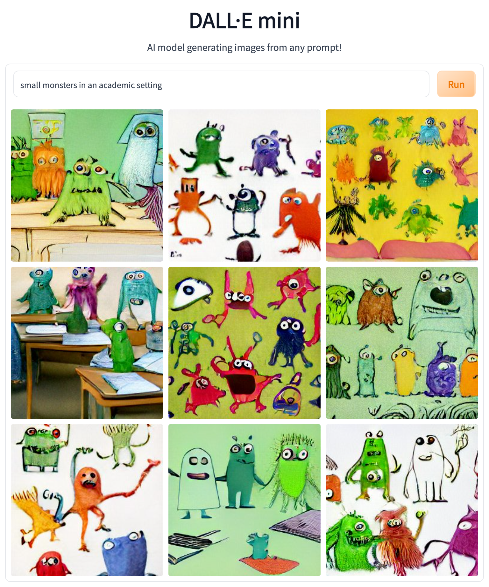

# Task Template

## Theme
For the second exercise of INDA, you will practice modeling objects in Java. This exercise will help you become familiar with the components of a Java class.

## 💀 Deadline
This work should be completed before the exercise on **Friday, 16th September**.

## 👩‍🏫 Instructions
For instructions on how to complete and submit the assignment, please refer to the [assignments section of the course instructions](https://gits-15.sys.kth.se/inda-22/course-instructions#assignments).

## 📝 Preparation
You must read and answer the questions in the OLI material for Module 2.

- Read [Looking Inside Classes](https://kth.oli.cmu.edu/jcourse/webui/syllabus/module.do?context=f5e5a808ac1f088812f2a8ce315bac60)
- If you have not done so, go to [OLI](https://kth.oli.cmu.edu/), sign up, and register for the course key `dd1337-ht22`.

> **Assistant's Note:** The OLI material and tasks might be slightly out of line this year, so it is okay to read ahead if you do not find all the material.

## ✅ Learning Goals
This week's learning goals include:
- Designing Java classes
- Adding instance fields
- Adding a constructor method
- Creating *getters* and *setters*
- Printing to the terminal
- Using the `main` method
- Scope (or *variable shadowing*)

## 🚨 Troubleshooting Guide
If you have any questions or problems, follow this procedure:

1. Look at this week's [posted issues](https://gits-15.sys.kth.se/inda-22/help/issues). Are other students asking about your problem?
2. If not, post a question yourself by creating a [New Issue](https://gits-15.sys.kth.se/inda-22/help/issues/new). Add a descriptive title, beginning with "Task *x*: *summary of problem here*".
3. Ask a TA in person during the [weekly lab](https://queue.csc.kth.se/Queue/INDA). Check your schedule to see when the next lab is.

We encourage you to discuss with your course friends, but **do not share answers**!

## 🏛 Assignment
At the Campus of the Royal Institute of Technology in Stockholm, Sweden, there exists a mythical creature called *Indamon*. Your task is to model these mythical creatures in Java! No one is alive to tell the story of how these creatures look, but with the help of [modern technology](https://huggingface.co/spaces/dalle-mini/dalle-mini) we have generated some pictures to spur your imagination:



### Exercise 2.0 -- Fields
In the [`src`](src) folder, create a new class called `Indamon.java`. In Java, you model attributes of real-world objects with [fields](https://docs.oracle.com/javase/tutorial/java/javaOO/variables.html). The *Indamon* class should have:

- `String` name  
- `int` hp (**hit points**)
- `int` attack 
- `int` defense
- `boolean` fainted

If done correctly, the main method provided in Example 1 should compile if added to `Indamon.java`.

<details>
  <summary> 🛠 Example 1 </summary>

  ```java
  class Indamon {

    // Put your fields here!

    public static void main(String[] args) {
      // create a new "Indamon" object
      Indamon glassey = new Indamon();

      // assign the instance variables to meaningful values
      glassey.name = "Glassey";
      glassey.hp = 10;
      glassey.attack = 5;
      glassey.defense = 5;

      // get the information of the assigned values
      System.out.println("Name: " + glassey.name);
      System.out.println("HP: " + glassey.hp);
      System.out.println("Attack value: " + glassey.attack);
      System.out.println("Defense value: " + glassey.defense);
    } // end main method

  } // end class
  ```
</details>


### Exercise 2.1 -- Getters and Setters
A defining concept in object-oriented programming is encapsulation. Encapsulation means preventing direct access to the state of your Indamon. This can be done by setting the access modifiers of the fields in the Indamon class to private. However, we still want to be able to read from and write to the fields. We can do this by adding accessors and mutators (so-called getters and setters methods). All fields should be accompanied by getters and setters, which makes a total of ten methods! If done correctly, the provided main method in Example 2 should compile if added to Indamon.java.

<details>
  <summary> 🛠 Example 2 </summary>

  ```java
    Copy code
    class Indamon {

      // Put your fields here!

      // Put your getters and setters here!

      public static void main(String[] args) {
        // create a new "Indamon" object
        Indamon glassey = new Indamon();

        // assign the instance variables to meaningful values
        glassey.setName("Glassey");
        glassey.setHp(10);
        glassey.setAttack(5);
        glassey.setDefense(2);

        // get the information of the assigned values
        System.out.println("Name: " + glassey.getName());
        System.out.println("HP: " + glassey.getHp());
        System.out.println("Attack value: " + glassey.getAttack());
        System.out.println("Defense value: " + glassey.getDefense());
        System.out.println("Is fainted: " + glassey.isFainted());
      } // end main method

    } // end class
  ```
</details>
Assistant's Note: The getters and setters of a field of boolean type follow a different naming convention from the usual getXXX() and setXXX(): isFainted() and setFainted().

Exercise 2.2 -- Constructor
Example 2 is a bit tedious; you don't want to add attributes to each object you create in this way. Instead, you should use a constructor. Implement a constructor following the examples in the OLI material (or the Official Oracle tutorial), and repeat Example 2 with this implementation.

Exercise 2.3 -- printInfo()
You want a way to print all the info about the Indamon to the terminal. Take a look at Example 3 and implement a method called printInfo(). The return type should be void.

<details>
  <summary> 🛠 Example 3 </summary>

```java
Copy code
public static void main(String[] args) {
  // create a new "Indamon" object
  Indamon glassey = new Indamon();

  // assign the instance variables to meaningful values
  // NOTE: if Exercise 2.3 is done correctly, you should use the constructor instead!
  glassey.setName("Glassey");
  glassey.setHp(10);
  glassey.setAttack(5);
  glassey.setDefense(2);

  // print information
  glassey.printInfo();
}
```
This call should print a message to the terminal:

shell
Copy code
> INFO
> Indamon: Glassey.
> HP: 10
> Attack: 5
> Defense: 2
> Fainted: false
</details>
Exercise 2.4 -- Indamon, attack!
Indamons are fierce creatures, and now we want to model a fight between them. In order to abstract this new functionality, you must implement a method called attack which will receive an Indamon object that represents the opponent in battle. If indamon A is attacking indamon B, the damage done follows the formula:


It should print the status to the terminal.

Assistant's Note: To define the return type of the method, think about what it's expecting to happen and what the instructions say about returning. Use the getters and setters to change the value of the object.

<details>
  <summary> 🛠 Example 4 </summary>

```java
Copy code
public static void main(String[] args) {
  // create two new "Indamon" objects
  Indamon glassey = new Indamon("Glassey", 10, 5, 5); 
  Indamon siberov = new Indamon("Siberov", 10, 5, 5);

  // call the "attack" method on glassey with siberov as an argument
  glassey.attack(siberov);
}
```
This call should print a similar message to the terminal:

markdown
Copy code
> Indamon Glassey attacked Indamon Siberov for 1.0 damage! 
> Indamon Siberov has 9 hp left!

</details>

###Exercise 2.5 -- Variable Shadowing
Take a look at the variable shadowing examples below. You might be asked to explain how to fix this example in class, so be prepared. You can look at the article on Variable Shadowing on Wikipedia and how the Java keyword this works.

```java
Copy code
public class Shadow1 {
    private int number = 0; // I want this number printed :(

    public void printShadow() {
        int number = 5;
        System.out.println(number); // It is printing the wrong number :(
    }

    public static void main(String[] args) {
        new Shadow1().printShadow();
    }
}
```


### Here is another example:

<details>

```java
Copy code
import java.awt.Color;

public class Horse {
  private String name;
  private Color color;

  public Horse(String name, Color color) {
    name = name; // this doesn't work :( Why?
    color = color;
  }

  public void neigh() {
    String name = "Uncle Dolan";
    System.out.println(name + " neighs! Eiiigha!"); // It is printing the wrong name :(
  }
}
```

</details>
Assistant's Note: Think about the local scope, global variables, and instance fields of the provided examples.

🐞 Bugs and Errors
If you find any inconsistencies or errors in this exercise, please open a New Issue with the title "Task x Error: summary of error here". Found bugs will be rewarded by mentions in the acknowledgment section.